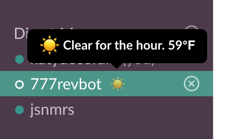

# 🌞 weather-status



Make your Slack status the weather forecast.


<!-- START GENERATED DOCUMENTATION -->

## Set up the workflow

To use this action, create a new workflow in `.github/workflows` and modify it as needed:

```yml
name: Weather status

on:
  schedule:
    - cron: "*/60 * * * *" # Every hour

jobs:
  weather_update:
    runs-on: macOS-latest
    name: Weather
    steps:
      - name: Checkout
        uses: actions/checkout@v3
      - name: Weather
        uses: katydecorah/weather-status@v2.0.0
        with:
          Latitude: ${{ secrets.Latitude }}
          Longitude: ${{ secrets.Longitude }}
          DarkSkySecretKey: ${{ secrets.DarkSkySecretKey }}
          SlackAccessToken: ${{ secrets.SlackAccessToken }}
```


## Action options

- `Latitude`: Required. The latitude of where you want to return the weather.
- `Longitude`: Required. The longitude of where you want to return the weather.
- `DarkSkySecretKey`: Required. Your Dark Sky secrety key. Use a respository secret https://docs.github.com/en/actions/security-guides/encrypted-secrets
- `SlackAccessToken`: Required. Your Slack access token. Use a respository secret https://docs.github.com/en/actions/security-guides/encrypted-secrets
<!-- END GENERATED DOCUMENTATION -->
